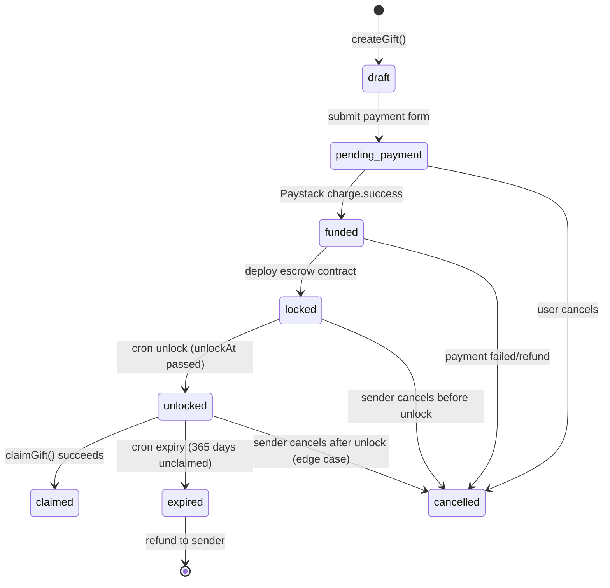

# Gift Lifecycle: States, Transitions, and Blockchain Interactions

This document describes the complete lifecycle of a Lumigift, from creation to claim or expiry. It covers both the database state management and the blockchain (Stellar/Soroban) interactions.

## Overview

A Lumigift follows this high-level flow:
1. **Creation**: User creates a gift with recipient details and unlock date
2. **Payment**: User pays in NGN via Paystack
3. **Locking**: Funds are converted to USDC and locked in a Soroban escrow contract
4. **Unlocking**: Cron job checks for gifts past their unlock date
5. **Claiming**: Recipient claims funds to their Stellar wallet
6. **Expiry**: Unclaimed gifts expire after 365 days and are refunded

## State Diagram

## Gift States

### draft
**Meaning**: Gift has been created but not yet submitted for payment.
**Triggered by**: `createGift()` API call with form data.
**Database state**: `status = "draft"`, no `contractId`, no `stellarTxHash`.
**Contract state**: N/A (no contract deployed yet).
**Valid transitions**: `pending_payment`, `cancelled`.

### pending_payment
**Meaning**: Gift is awaiting payment completion from Paystack.
**Triggered by**: User submits payment form, Paystack redirects to callback URL.
**Database state**: `status = "pending_payment"`, no `contractId`, no `stellarTxHash`.
**Contract state**: N/A.
**Valid transitions**: `funded` (payment success), `cancelled` (payment failed or timeout).

### funded
**Meaning**: Payment has succeeded, funds are available for contract deployment.
**Triggered by**: Paystack webhook `charge.success` event.
**Database state**: `status = "funded"`, no `contractId`, `stellarTxHash` may be set if funds transferred.
**Contract state**: N/A (contract not yet deployed).
**Valid transitions**: `locked` (contract deployment succeeds), `cancelled` (deployment fails).

### locked
**Meaning**: Funds are locked in a Soroban escrow contract until the unlock date.
**Triggered by**: Successful escrow contract deployment and funding.
**Database state**: `status = "locked"`, `contractId` set to deployed contract address, `stellarTxHash` set.
**Contract state**: Contract initialized with `(sender, recipient, USDC, amount, unlock_time)`, funds transferred to contract.
**Valid transitions**: `unlocked` (cron job), `cancelled` (sender cancellation before unlock).

### unlocked
**Meaning**: Unlock date has passed, recipient can now claim the funds.
**Triggered by**: Daily cron job (`/api/cron/unlock`) finds gifts where `unlockAt <= now`.
**Database state**: `status = "unlocked"`, `contractId` present.
**Contract state**: Contract still holds funds, `claimed = false`.
**Valid transitions**: `claimed` (successful claim), `expired` (365 days pass), `cancelled` (edge case).

### claimed
**Meaning**: Funds have been successfully transferred to the recipient's Stellar wallet.
**Triggered by**: Recipient calls `claimGift()` with valid Stellar public key.
**Database state**: `status = "claimed"`, `claimTxHash` set to the payment transaction hash.
**Contract state**: `claimed = true`, funds transferred out.
**Valid transitions**: None (terminal state).

### expired
**Meaning**: Gift was unlocked but not claimed within 365 days, funds refunded to sender.
**Triggered by**: Daily cron job (`/api/cron/expiry`) finds unlocked gifts older than 365 days.
**Database state**: `status = "expired"`.
**Contract state**: Funds refunded to sender's Stellar address.
**Valid transitions**: None (terminal state).

### cancelled
**Meaning**: Gift was cancelled by sender or due to payment/deployment failure.
**Triggered by**: Explicit cancellation or failure scenarios.
**Database state**: `status = "cancelled"`.
**Contract state**: If contract deployed, may need cleanup; otherwise N/A.
**Valid transitions**: None (terminal state).

## Blockchain Interactions

### Contract Deployment
- **When**: After payment success (`funded` → `locked`)
- **What**: Deploy new contract instance with `initialize(sender, recipient, USDC, amount, unlock_time)`
- **Funds**: Transfer USDC from server escrow account to contract
- **Failure**: If deployment fails, gift remains `funded` or transitions to `cancelled`

### Claim Process
- **When**: Recipient claims unlocked gift
- **What**: Contract `claim()` transfers funds to recipient
- **Validation**: Contract verifies `caller == recipient` and `timestamp >= unlock_time`
- **Failure**: Contract reverts if not unlocked or already claimed

### Expiry/Refund
- **When**: Unclaimed gift expires after 365 days
- **What**: Refund USDC from contract to sender's Stellar address
- **Implementation**: Contract may need `refund()` function or admin withdrawal

## Failure Scenarios

### Payment Succeeded but Contract Init Failed
- **Symptoms**: Gift stuck in `funded` state, no `contractId`
- **Diagnosis**: Check Stellar network status, contract deployment logs
- **Resolution**: Retry contract deployment, or refund payment and cancel gift
- **Prevention**: Implement retry logic with exponential backoff

### Cron Job Failure
- **Symptoms**: Gifts remain `locked` past unlock date
- **Diagnosis**: Check cron logs, Vercel function timeouts
- **Resolution**: Manual unlock via admin interface, or adjust cron schedule
- **Prevention**: Monitor cron success rates, implement alerting

### Claim Transaction Failed
- **Symptoms**: Gift remains `unlocked`, claim button shows error
- **Diagnosis**: Check Stellar network, recipient trustline, contract state
- **Resolution**: Retry claim, or manual refund if contract allows
- **Prevention**: Validate recipient address format and trustline before claim

### Network Degradation
- **Symptoms**: Contract deployments or claims fail intermittently
- **Diagnosis**: Monitor Stellar RPC status, Horizon API availability
- **Resolution**: Queue operations for retry during outages
- **Prevention**: Implement circuit breakers, fallback to manual processing

## Database Schema Notes

The `gifts` table includes:
- `contractId`: Soroban contract address (set on `funded` → `locked`)
- `stellarTxHash`: Funding transaction hash (set on contract deployment)
- `claimTxHash`: Claim transaction hash (set on successful claim)

All timestamps use UTC. Status transitions are validated by `assertValidTransition()`.